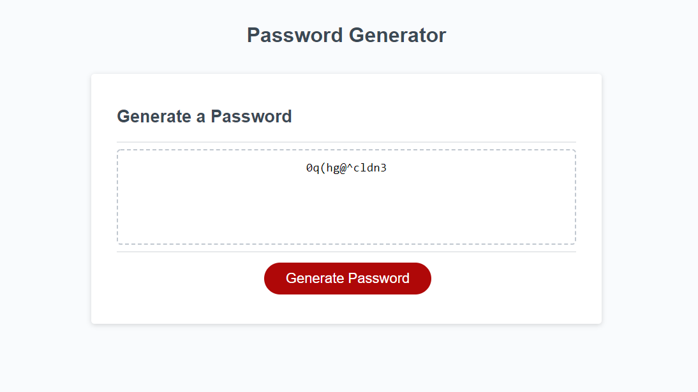

  # Secure Your Word
  

  ## Description
  Creates a customized password using selected criteria. (Uppercase, lowercase, special character, numbers, and word length)

  ## Table of Contents
  * [Usage](#usage)
  * [Contributing](#contributing)
  
  ## Usage
  This is useful for creating a secure password utilizing personal needs.

  

  ## Contributing
  Stormblessed624

  ## Questions?
  - Reach me at my email: matt.white.624@gmail.com
  - GitHub username: [Stormblessed624](https://github.com/Stormblessed624/)

  

